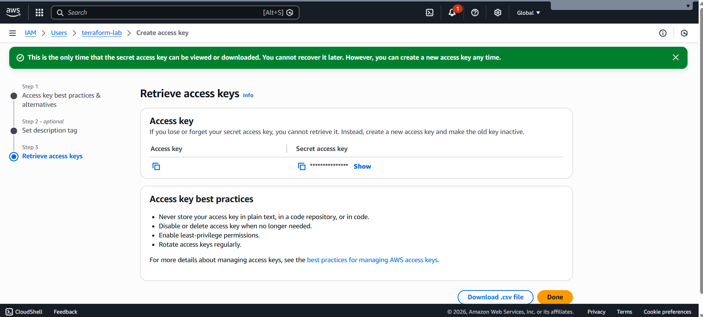
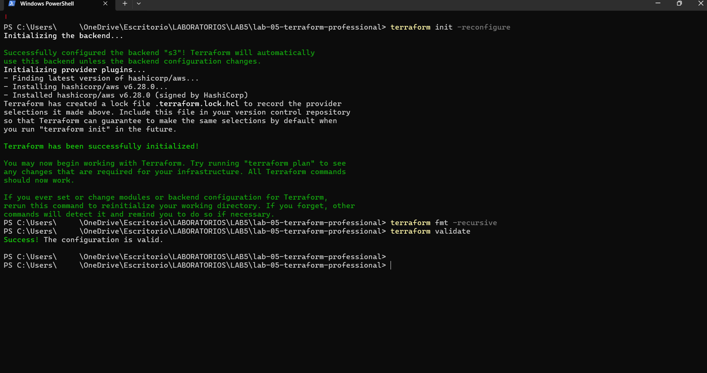
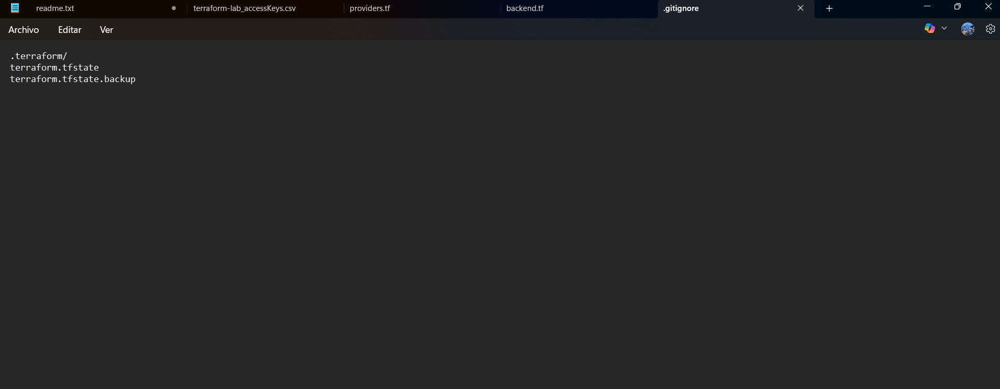
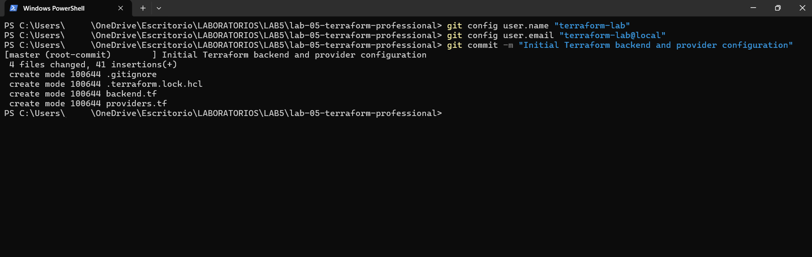

# terraform-lab-05-backend-s3
Terraform lab implementing a remote backend using Amazon S3 for secure state management and collaboration.
# Terraform Lab 05 – Remote Backend with Amazon S3

This project demonstrates how to configure Terraform to use a remote backend with Amazon S3, enabling secure, centralized, and consistent state management. This setup follows Infrastructure as Code best practices and simulates a real-world collaborative environment.

---

## 🎯 Lab Objectives

- Configure a remote backend using Amazon S3
- Initialize Terraform with backend reconfiguration
- Validate provider and backend configuration
- Apply formatting and validation best practices
- Secure credentials using IAM users and access keys
- Prepare the project for version control and collaboration

---

## 🧰 Tools & Technologies

- Terraform
- Amazon S3
- AWS IAM
- Git & GitHub
- Windows PowerShell

---

## 📸 Lab Walkthrough

### ✅ 1. IAM User Creation
An IAM user was created to manage Terraform authentication securely.

---

### 🔐 2. Access Key Generation
Access keys were generated for programmatic authentication (sensitive data was censored).

---

### ⚙️ 3. Terraform Backend Initialization
Terraform was initialized and configured to use an S3 backend for remote state storage.

---

### ✔️ 4. Terraform Validation
The configuration was validated to ensure correctness and formatting standards.

---

### 🗃️ 5. Initial Git Commit
The project was committed to version control following best practices.

---

## 🧠 Key Learnings

- How to configure Terraform remote backends using Amazon S3
- Managing infrastructure state securely and centrally
- IAM credential management best practices
- Terraform initialization and validation workflows
- Version control integration for Infrastructure as Code projects

---

## 🚀 Author

**Juliana Arena**  
AWS Certified Solutions Architect – Associate  
Cloud & Infrastructure Enthusiast
